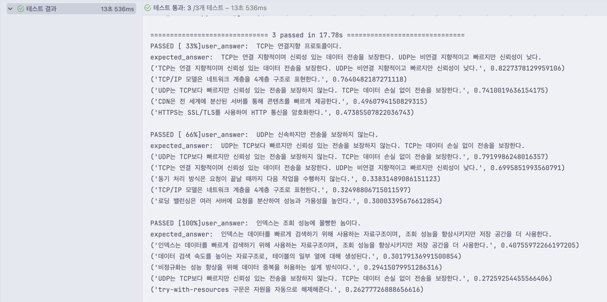
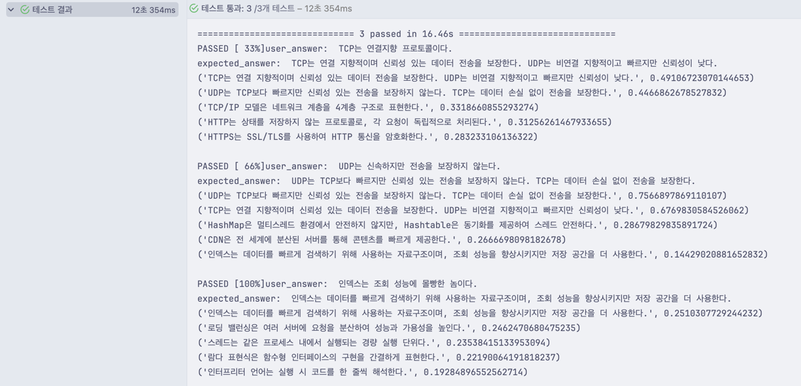
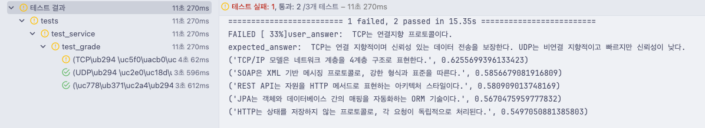
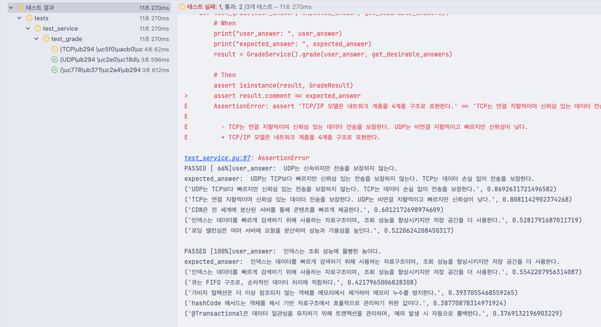

# CS 물어보는 스핑크스 채점기

## 개발 목표
- 서술형 문제 채점
- input: `[유저의 제출답안, 사전 정의된 모범답안]`
- output: `[유사도, 근사한 모범답안]`
- SBERT(문장 임베딩) + Cosine Similarity(코사인 유사도) 활용
  - 문장 벡터의 유사도로 서술형 답변 점수 산출
- 문자열 처리, 데이터분석 특화된 Python 모듈 분리 구현
  - Origin Server(Spring Boot)와 분리하여 MSA 형태 구동

## SBERT 모델 비교
#### 결론
- 파인튜닝을 하지 않고 바로 사용 가능한가
- 네트워크 통신으로 활용가능한가
  - hugging face 활용가능한가
  - CORS, Auth 없이 활용가능한가

다음을 고려하여 `paraphrase_model` 선택

### sentence-transformers/paraphrase-multilingual-MiniLM-L12-v2
- 다국어 경량 SBERT 모델, 한국어 포함, 바로 사용 가능
- 장점: 경량, 빠른 추론 속도, 다양한 언어 지원
- 단점: 한국어 성능은 한국어 특화 모델보다 낮을 수 있음
- 테스트 결과



### distiluse-base-multilingual-cased-v1
- 다국어 SBERT 모델, cased version
- 장점: 여러 언어 지원, 비교적 경량
- 단점: 한국어 특화 데이터셋 기반이 아님
- 테스트 결과



### snunlp/KR-SBERT-V40K-klueNLI-augSTS
- 한국어 특화 SBERT 모델, KLUE NLI + AugSTS 학습
- 장점: 한국어 문장 유사도, 의미 검색 최적화
- 단점: 모델 크기 중간급, 메모리 사용량 있음
- 테스트 결과




### snunlp/KR-SBERT-Medium-klueNLItriplet_PARpair-klueSTS
- 한국어 중형 SBERT, KLUE NLI triplet + PAR pair + klueSTS 학습
- 장점: 문장 유사도 성능 향상, 다양한 데이터셋 활용
- 단점: 한국어 전용, 모델 크기 중간
- 테스트 결과


## 프로젝트 구조
```markdown
project-root/
├── mypy.ini
├── pyproject.toml          # 프로젝트 메타데이터(의존성, 스크립트 등)
├── Dockerfile
├── docker-compose.yml
└── app/
    ├── __init__.py
    ├── main.py             # FastAPI 인스턴스 생성 및 라우터 포함
    ├── core/
    │   ├── config.py       # 환경변수 관리(BaseSettings)
    │   ├── logging.py      # 로깅 설정
    │   ├── dependencies.py # 공통 의존성(예: DB 세션)
    │   └── events.py       # startup/shutdown 이벤트 핸들러
    ├── db/
    │   ├── base.py         # SQLAlchemy Base 클래스
    │   ├── session.py      # 세션 생성 및 관리 함수
    │   └── init_db.py      # 초기 데이터 삽입 스크립트
    ├── models/
    │   └── user.py         # ORM 모델(SQLAlchemy 또는 SQLModel)
    ├── schemas/
    │   └── user.py         # Pydantic 모델(입력·출력 스키마)
    ├── crud/               # 또는 services/
    │   └── user.py         # DB 조작 및 비즈니스 로직
    ├── api/
    │   └── v1/
    │       ├── router.py   # APIRouter 인스턴스
    │       └── user.py     # 엔드포인트 정의
    └── tests/
        ├── conftest.py     # pytest 설정(예: 테스트용 DB)
        └── test_user.py    # 유닛·통합 테스트
```