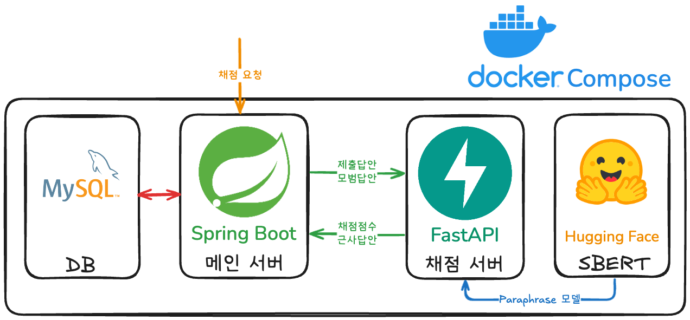
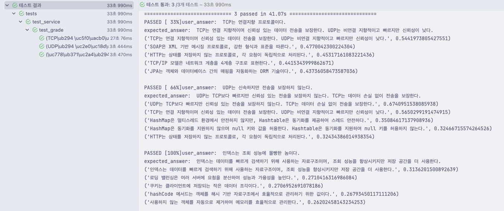

# 🦁 CS 물어보는 스핑크스 채점기 🔮

## 🎯 개발 목표
- 서술형 문제 채점
- input: `[유저의 제출답안, 사전 정의된 모범답안]`
- output: `[유사도, 근사한 모범답안]`
- SBERT(문장 임베딩) + Cosine Similarity(코사인 유사도) 활용
  - 문장 벡터의 유사도로 서술형 답변 점수 산출
- 문자열 처리, 데이터분석 특화된 Python 모듈 분리 구현
  - Origin Server(Spring Boot)와 분리하여 MSA 형태 구동

## 🧬 프로젝트 구조

## ⚖️ SBERT 모델 비교
#### 결론
- 파인튜닝을 하지 않고 바로 사용 가능한가
- 네트워크 통신으로 활용가능한가
  - hugging face 활용가능한가
  - CORS, Auth 없이 활용가능한가

다음을 고려하여 `paraphrase_model` 선택

### 1️⃣ sentence-transformers/paraphrase-multilingual-MiniLM-L12-v2
- 다국어 경량 SBERT 모델 (한국어 포함)
- 장점
  - 경량
  - 빠른 추론 속도
  - 다양한 언어 지원
- 단점
  - 한국어 성능은 한국어 특화 모델보다 낮을 수 있음
- 테스트 결과

### 2️⃣ snunlp/KR-SBERT-Medium-klueNLItriplet_PARpair-klueSTS
- 한국어 중형 SBERT
- KLUE NLI triplet + PAR pair + klueSTS 학습
- 장점
  - 문장 유사도 성능 향상
  - 다양한 데이터셋 활용
- 단점
  - 한국어 전용
  - 모델 크기 중간
- 테스트 결과

### 3️⃣ distiluse-base-multilingual-cased-v1
- 다국어 SBERT 모델 (cased version)
- 장점
  - 여러 언어 지원
  - 비교적 경량
- 단점
  - 한국어 특화 데이터셋 기반이 아님
- 테스트 결과

### 4️⃣ snunlp/KR-SBERT-V40K-klueNLI-augSTS
- 한국어 특화 SBERT 모델
- KLUE NLI + AugSTS 학습
- 장점
  - 한국어 문장 유사도
  - 의미 검색 최적화
- 단점
  - 모델 크기 중간급
  - 메모리 사용량 있음
- 테스트 결과

